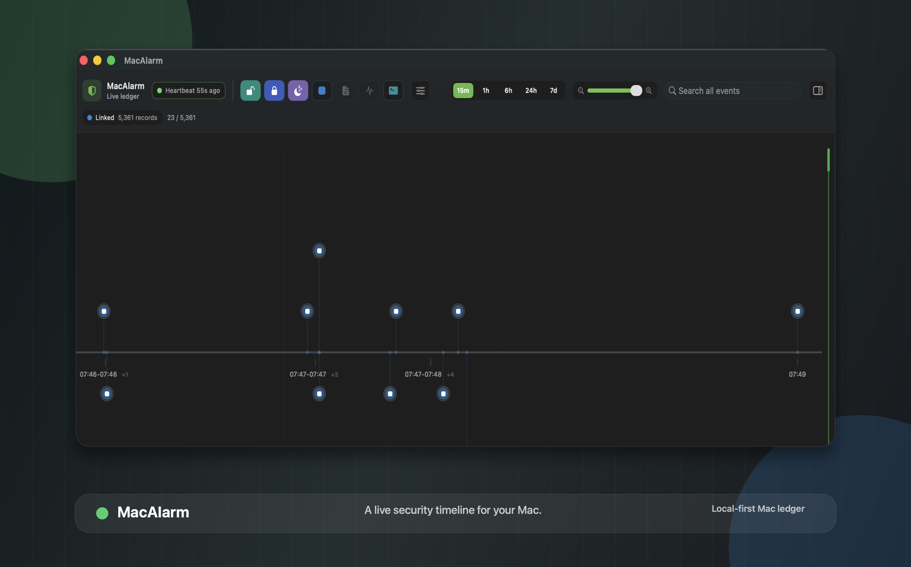

  

<h1 align="center">MacAlarm</h1>

  
  
  
  
  

MacAlarm is a consent-first macOS alarm recorder and timeline viewer, written in pure Swift. It records meaningful local security and system events — screen lock/unlock, sleep/wake, app activity, file changes, notification results, and custom events — into a tamper-evident HMAC hash-chain ledger, then shows them in a live SwiftUI timeline so you can answer one question later: *what happened while I was away?* It behaves like a transparent macOS citizen: no stealth, no privacy-prompt bypass.

## Install

Grab the latest build from **[Releases](https://github.com/JCTec/MacAlarm/releases/latest)**:

1. **Download** `MacAlarm-<version>.dmg`.
2. **Open** it and drag `MacAlarm.app` to your Applications folder.
3. **Launch** MacAlarm, choose **Recorder → Install Recorder at Login…**, and approve macOS Background Items if prompted.

The DMG is intentionally drag-only — setup lives inside the app, not in the DMG. Unsigned/prerelease builds are marked as such in their release notes. To build locally instead, see [Contributing](https://github.com/JCTec/MacAlarm/wiki/Contributing).

## What It Does Not Record

MacAlarm should stay inside these boundaries:

- no keylogging
- no screenshots
- no microphone recording by the agent
- no chat, browser, or private-content scraping
- no hidden persistence
- no privilege escalation without explicit user consent
- no bypassing macOS privacy prompts

Any contribution that changes those boundaries should be treated as a security/design discussion first, not a casual feature.

## Features

- **Tamper-evident ledger** — every event is HMAC-signed into an append-only hash chain, with off-device iCloud hash anchoring to detect truncation or rewrites.
- **Live timeline** — a horizontal SwiftUI timeline with filters, search, zoom, an event inspector, and at-a-glance recorder health and ledger integrity.
- **Native event sources** — screen lock/unlock, sleep/wake, app launch/activation/termination, file/canary changes, agent heartbeats, and notification results.
- **Custom events** — scripts and tools emit structured events via `macalarmctl emit-log` and appear in the timeline.
- **Watched Folders** — grant folders through a standard open panel; changes flow into the ledger (active while the app runs on the sandboxed build).
- **App Store ready** — a fully sandboxed build with an App Group container, SMAppService login item, and attributed failures for anything the sandbox forbids.

## Documentation

Full documentation lives in the **[Wiki](https://github.com/JCTec/MacAlarm/wiki)** (synced automatically from `docs/`, which remains the source of truth):

| Page | What it covers |
| --- | --- |
| [Architecture](https://github.com/JCTec/MacAlarm/wiki/Architecture) | Package layout, ledger, spool transport, and boundaries |
| [Security Model](https://github.com/JCTec/MacAlarm/wiki/Security-Model) | Threat model, HMAC hash chain, and hash anchoring |
| [Sandbox Behavior](https://github.com/JCTec/MacAlarm/wiki/Sandbox-Behavior) | Per-feature sandboxed vs unsandboxed behavior |
| [Custom Events](https://github.com/JCTec/MacAlarm/wiki/Custom-Events) | Emitting events from scripts and tools |
| [Installer](https://github.com/JCTec/MacAlarm/wiki/Installer) | Recorder install/login-item flow |
| [Uninstall](https://github.com/JCTec/MacAlarm/wiki/Uninstall) | Removing MacAlarm and its local data |
| [Contributing](https://github.com/JCTec/MacAlarm/wiki/Contributing) | Building, testing, and the release flow |

## License

MacAlarm is released under the [MIT License](LICENSE).
