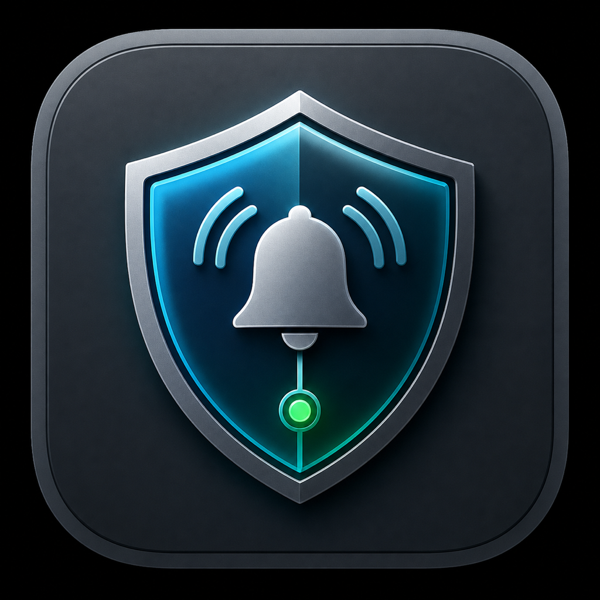
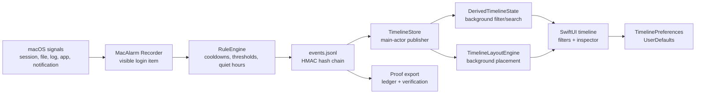

# MacAlarm



MacAlarm is a consent-first macOS alarm recorder and timeline viewer written in pure Swift.

It records important local security and system events into a tamper-evident JSONL ledger, shows them in a live SwiftUI timeline, and uses native notifications as the active alert channel. Telegram and remote server delivery are intentionally future work; the current priority is a reliable local recorder that behaves like a transparent macOS citizen.

MacAlarm targets Swift 6 and macOS 14+.

## Why It Exists

Macs already know when meaningful things happen: the screen unlocks, the machine wakes, apps activate, files change, notifications are attempted, and custom tools emit logs. MacAlarm turns those signals into a readable history so you can answer a simple question later:

```text
What happened while I was away?
```

The project is designed for personal security, local audit trails, and open integration. It is not spyware, stealth monitoring, or a bypass for macOS privacy controls.

## What It Records

Current local event sources include:

- screen lock and unlock signals
- sleep, wake, screen sleep, and screen wake signals
- app launch, activation, focus, and termination signals
- file/canary changes through `DispatchSource`
- agent heartbeat and runtime health events
- notification test and delivery result events
- ledger integrity/proof export metadata
- opt-in custom events emitted through macOS Unified Logging

Custom producers can emit structured events with `macalarmctl emit-log`, which makes MacAlarm useful for scripts, audio detectors, backup jobs, local security checks, and other tools that want to appear in the timeline.

## What It Does Not Record

MacAlarm should stay inside these boundaries:

- no keylogging
- no screenshots
- no microphone recording by the agent
- no chat, browser, or private-content scraping
- no hidden persistence
- no privilege escalation without explicit user consent
- no bypassing macOS privacy prompts

Any contribution that changes those boundaries should be treated as a security/design discussion first, not a casual feature.

## App Experience

The packaged app has two jobs:

- register and control the background recorder
- read the ledger and render the live timeline

The recorder keeps writing while the app window is closed. The app opens into a horizontal left-to-right timeline where older events are on the left and newer events are on the right. Filter buttons prioritize or hide event families, the inspector shows the selected event in a vertical timeline, and the top bar exposes search, time range, zoom, recorder health, and ledger integrity status.

## Install

For local testing, build the release package:

```sh
./scripts/package-release.sh
./scripts/package-dmg.sh
```

Then:

1. Open `dist/MacAlarm-0.1.0.dmg`.
2. Drag `MacAlarm.app` to Applications.
3. Open `MacAlarm.app` from Applications.
4. Choose `Recorder > Install Recorder at Login...`.
5. Approve macOS Background Items if prompted.

The DMG is intentionally drag-only. Setup commands live inside the app, not in the DMG root.

Useful installed checks:

```sh
"$HOME/Library/Application Support/MacAlarm/bin/macalarmctl" status
"$HOME/Library/Application Support/MacAlarm/bin/macalarmctl" health
"$HOME/Library/Application Support/MacAlarm/bin/macalarmctl" doctor
"$HOME/Library/Application Support/MacAlarm/bin/macalarmctl" verify-ledger \
  --config "$HOME/Library/Application Support/MacAlarm/config.json"
```

See [Installer](docs/INSTALLER.md) and [Uninstall And Local Data](docs/UNINSTALL.md).

## Develop

```sh
swift build
swift run -c debug macalarm-tests
./scripts/run-viewer-debug.sh
```

Full local gate:

```sh
./scripts/check-repository-metadata.sh
./scripts/check-format.sh
./scripts/check-swiftui-appkit-boundaries.sh
./scripts/check-swiftui-background-tasks.sh
./scripts/check-swiftui-main-thread-io.sh
./scripts/check-swiftui-store-boundaries.sh
./scripts/verify-release.sh
MACALARM_SKIP_RELEASE_BUILD=1 MACALARM_DMG_FINDER_LAYOUT=skip ./scripts/package-dmg.sh
./scripts/audit-distribution.sh
```

Manual probes:

```sh
swift run macalarm-probe --self-test --duration 2
swift run macalarm-probe --session --duration 15
swift run macalarm-probe --watch /path/to/canary.txt --duration 15
swift run macalarm-probe --logs
```

For real lock/unlock validation, run the session probe, lock the Mac, then unlock it. The self-test emits a labeled synthetic event; it does not prove that macOS delivered a real lock/unlock event.

## Architecture



Core targets:

- `MacAlarmCore`: event models, hash-chain ledger, rules, event sources, notification dispatch, config, LaunchAgent helpers, proof export.
- `MacAlarmAppSupport`: SwiftUI/AppKit app support, timeline state, layout, filters, inspector, preferences, and installer UI.
- `MacAlarmApp`: tiny executable entrypoint for the viewer app.
- `MacAlarmAgent`: background recorder executable.
- `MacAlarmCLI`: `macalarmctl` command line interface.
- `MacAlarmCLIKit`: testable CLI helper logic.
- `MacAlarmProbe`: safe local probe executable for native hook research.
- `MacAlarmTests`: custom pure Swift test runner.

The app keeps expensive work off the main actor where practical: ledger IO, JSON decoding, hash verification, proof export, notification diagnostics, CSV generation, filter/search derivation, timeline placement, preference encoding, Finder target preparation, and LaunchAgent process waits all run in background tasks and publish finished values back to SwiftUI.

See [Architecture](docs/ARCHITECTURE.md).

## Data Locations

Installed MacAlarm uses predictable per-user locations:

```text
~/Library/Application Support/MacAlarm/
  config.json
  events.jsonl
  runtime/status.json
  secrets/ledger-hmac-key
  bin/macalarmctl

~/Library/Logs/MacAlarm/
~/Library/LaunchAgents/dev.jc.macalarm.agent.plist
```

The LaunchAgent plist is only used by the legacy/fallback install path. Packaged builds prefer the bundled visible login item helper through `SMAppService`.

## Verification Status

The current local gate has covered:

- repository metadata checks
- Swift formatting
- SwiftUI/AppKit boundary checks
- background task boundary checks
- main-thread IO checks
- store-boundary checks
- debug build
- custom Swift test runner
- release packaging
- drag-only DMG packaging
- distribution audit
- codesign verification
- zip and DMG checksum generation

Detailed verification notes live in [Verification](docs/VERIFICATION.md).

## Documentation

- [Architecture](docs/ARCHITECTURE.md)
- [Hook Matrix](ALARM_HOOKS.md)
- [Custom Events](docs/CUSTOM_EVENTS.md)
- [Notifications](docs/NOTIFICATIONS.md)
- [Telegram](docs/TELEGRAM.md)
- [Security Model](docs/SECURITY_MODEL.md)
- [Security Policy](SECURITY.md)
- [Installer](docs/INSTALLER.md)
- [Uninstall And Local Data](docs/UNINSTALL.md)
- [macOS Background Process Guide](docs/MACOS_BACKGROUND_PROCESS_GUIDE.md)
- [Production Readiness](docs/PRODUCTION_READINESS.md)
- [Release Checklist](docs/RELEASE_CHECKLIST.md)
- [Open-Source Roadmap](docs/OPEN_SOURCE_ROADMAP.md)
- [Technical Plan](docs/TECHNICAL_PLAN.md)
- [SwiftUI Viewer](docs/SWIFTUI_VIEWER.md)
- [Verification](docs/VERIFICATION.md)
- [Contributing](CONTRIBUTING.md)

## Contributing

MacAlarm welcomes narrow, auditable improvements: better event normalization, stronger verification, cleaner SwiftUI, safer installer behavior, clearer docs, and native integrations that respect user consent.

Before opening a pull request, read [Contributing](CONTRIBUTING.md) and [Security Policy](SECURITY.md). Public issues and pull requests must not include private ledger records, hostnames, paths, tokens, secrets, or exploit details.

## License

Public license selection is still pending. Add a `LICENSE` file before announcing the repository as open source.
